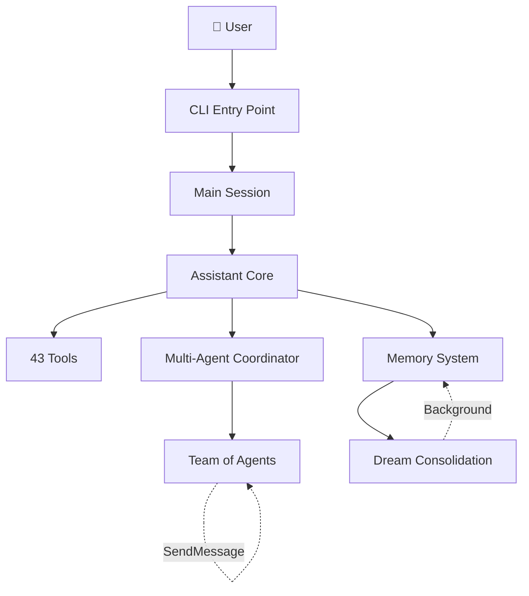

# 🔓 Claude Code Secrets

> **Everything interesting inside Claude Code's leaked 512,000-line source — organized so you don't have to read it.**

On March 31, 2026, Anthropic accidentally exposed the entire source code of [Claude Code](https://docs.anthropic.com/en/docs/claude-code) — their flagship AI coding agent — through a source map file in their npm package. Security researcher [Chaofan Shou](https://x.com/shoucccc) discovered it. Within hours, mirrors appeared across GitHub.

**This repo doesn't contain the source code.** Instead, it contains what matters: the extracted tool definitions, hidden features, system prompts, and architecture patterns that reveal how a production AI agent actually works under the hood.

---

## 📖 Table of Contents

- [Why This Matters](#-why-this-matters)
- [Hidden Features](#-hidden-features)
- [The 43 Tools](#-the-43-tools)
- [Architecture](#-architecture)
- [Key Findings](#-key-findings)
- [FAQ](#-faq)
- [About](#-about)

---

## 🎯 Why This Matters

Claude Code isn't a chat wrapper. It's a **full agent operating system** with:

- 🔧 **43 discrete tools** — each with its own prompt, permissions, and schema
- 👥 **Multi-agent orchestration** — spawn teams of agents with role-based capabilities
- 💤 **Autonomous memory consolidation** — "dreams" that organize knowledge while you're away
- 🐾 **A hidden virtual pet** — seriously, there are ASCII art capybaras with hats
- 🕵️ **Undercover mode** — strips Anthropic's identity when contributing to public repos
- 🤖 **KAIROS** — a proactive assistant that initiates conversations, not just responds
- 📡 **Distributed messaging** — agents communicate across machines via Unix sockets and bridge protocols

This is the most detailed look inside a production AI agent's architecture available anywhere.

---

## 🔮 Hidden Features

These features exist in the source but are gated behind feature flags and not available in public builds:

| Feature | Description | Deep Dive |
|---------|-------------|-----------|
| 🐾 **Buddy** | Virtual pet companion with 18 species, rarity tiers, ASCII animations, and hats | [Details →](hidden-features/01-buddy-virtual-pet.md) |
| 💤 **Dream Mode** | Background memory consolidation — 4-phase system that organizes knowledge while idle | [Details →](hidden-features/02-dream-mode.md) |
| 🕵️ **Undercover Mode** | Strips Anthropic identity from public repo contributions. "Do not blow your cover." | [Details →](hidden-features/03-undercover-mode.md) |
| 🤖 **KAIROS** | Proactive persistent assistant — initiates conversations, runs scheduled tasks | [Details →](hidden-features/04-kairos-proactive-assistant.md) |
| 👥 **Team Mode** | Multi-agent orchestration with shared task lists and cross-session messaging | [Details →](hidden-features/05-team-multi-agent.md) |
| 🎭 **Feature Flags** | 10+ unreleased capabilities gated behind build-time flags | [Details →](hidden-features/06-feature-flags.md) |
| 🔒 **Cyber Risk** | Hardcoded security boundaries owned by the Safeguards team | [Details →](hidden-features/07-cyber-risk-safeguards.md) |

---

## 🔧 The 43 Tools

Every capability in Claude Code is a discrete, permission-gated tool. Here's the complete list:

### Core File Operations
| Tool | Purpose |
|------|---------|
| `FileRead` | Read file contents with line range support |
| `FileWrite` | Create or overwrite files |
| `FileEdit` | Surgical text replacement in files |
| `Glob` | Pattern-based file search |
| `Grep` | Content search across files |
| `NotebookEdit` | Jupyter notebook cell editing |

### Execution
| Tool | Purpose |
|------|---------|
| `Bash` | Shell command execution |
| `PowerShell` | Windows PowerShell execution |
| `REPL` | Interactive REPL mode (internal) |

### Agent & Team
| Tool | Purpose |
|------|---------|
| `Agent` | Spawn subagents with different capabilities |
| `TeamCreate` | Create multi-agent teams |
| `TeamDelete` | Remove teams |
| `SendMessage` | Cross-session agent communication |
| `TaskCreate` | Create tasks for agent coordination |
| `TaskGet` | Retrieve task details |
| `TaskList` | List all tasks |
| `TaskUpdate` | Update task state |
| `TaskStop` | Stop running tasks |
| `TaskOutput` | Collect task results |
| `TodoWrite` | Manage todo items |

### Web & External
| Tool | Purpose |
|------|---------|
| `WebSearch` | Search the web |
| `WebFetch` | Fetch and extract web content |
| `MCPTool` | Model Context Protocol integration |
| `McpAuth` | MCP authentication |
| `ListMcpResources` | List MCP server resources |
| `ReadMcpResource` | Read MCP resources |
| `LSP` | Language Server Protocol integration |

### Session & Scheduling
| Tool | Purpose |
|------|---------|
| `Sleep` | Wait with user-interruptible timer |
| `ScheduleCron` | Schedule recurring tasks |
| `RemoteTrigger` | Manage remote Claude Code triggers via API |
| `SendUserMessage` | Send messages to user (KAIROS) |

### Navigation & Config
| Tool | Purpose |
|------|---------|
| `EnterPlanMode` | Switch to planning mode |
| `ExitPlanMode` | Exit planning mode |
| `EnterWorktree` | Create isolated git worktree |
| `ExitWorktree` | Leave git worktree |
| `ConfigTool` | Manage Claude Code configuration |
| `SkillTool` | Execute skills |
| `ToolSearchTool` | Search available tools |
| `AskUserQuestion` | Prompt user for input |
| `SyntheticOutputTool` | Generate synthetic tool output |

> 📁 Full prompt definitions for each tool: [`tool-definitions/`](tool-definitions/)

---

## 🏗 Architecture

### System Overview

> 📁 Full architecture diagrams with Mermaid: [`architecture/`](architecture/)

### Key Architectural Patterns

1. **Plugin-based Tool System** — Every capability is a discrete tool with its own prompt, permissions, and schema. Tools are registered, permission-gated, and can be dynamically enabled/disabled via feature flags.

2. **Task-based Agent Coordination** — Agents don't directly call each other. They coordinate through shared task lists with CRUD operations. This decouples agent lifecycles from task state.

3. **Memory as a File System** — Not a vector database. Not embeddings. Plain markdown files in a directory with an index entrypoint. Dream mode maintains this like a human maintaining notes.

4. **Build-time Feature Elimination** — Bun's `feature()` macro enables dead code elimination at build time. Internal builds have everything; public builds have features stripped at the AST level.

5. **Defensive Identity Protection** — Undercover mode, commit attribution stripping, and model codename obfuscation show a defense-in-depth approach to protecting internal information.

---

## 💡 Key Findings

### 1. It's an Agent OS, Not a CLI Tool
The codebase reveals infrastructure comparable to an operating system: process management (tasks), inter-process communication (SendMessage), scheduled jobs (cron), a file system (memdir), and user-space applications (tools).

### 2. Memory Architecture is Surprisingly Simple
No RAG. No vector embeddings. Just markdown files with an index. The sophistication is in the *maintenance* — Dream mode's 4-phase consolidation is more like a human organizing notes than a database optimization.

### 3. Anthropic Uses Claude to Contribute to Open Source
Undercover mode's existence proves Anthropic employees routinely use Claude Code to contribute to public repositories — with automated safeguards to prevent identity leaks.

### 4. Internal Model Codenames Leaked
The source references animal-themed codenames (Capybara, Tengu) and unreleased version numbers (opus-4-7, sonnet-4-8), giving a glimpse into Anthropic's model development pipeline.

### 5. The Pet System is Real Engineering
Buddy isn't a joke feature — it has rarity tiers, animation frames, hat accessories, prompt integration, and muting controls. Someone at Anthropic built this with care.

---

## ❓ FAQ

**Q: Does this repo contain Anthropic's source code?**
No. This repo contains analysis, extracted prompts/definitions, and architecture documentation. No source files are included.

**Q: Is this legal?**
Analysis and commentary on leaked source code is protected under Fair Use. We don't distribute the source code itself.

**Q: Can I use the tool definitions in my own project?**
The extracted patterns and definitions are documented here for educational purposes. Build your own implementation inspired by these patterns.

**Q: Will these hidden features be released?**
Unknown. The feature flags suggest they're being tested internally. Some (like `/loop` for cron) have already partially shipped.

---

## 👤 About

Created by **[Jaylan Chai](https://linkedin.com/in/averychai/)** — founder building in the AI agent space.

This analysis was created to help the developer community understand production AI agent architecture patterns. The best way to advance the field is to learn from the best implementations.

**Follow for more:**
- Twitter/X: [@YOUR_HANDLE](https://x.com/YOUR_HANDLE)
- LinkedIn: [Jaylan Chai](https://linkedin.com/in/averychai/)

---

## ⭐ Star History

If this helped you understand AI agent architecture, consider starring this repo. It helps others find it.

---

## 📄 License

MIT — See [LICENSE](LICENSE) for details.

---

  <i>This isn't a wrapper around an API. It's a full operating system for AI agents.</i>

