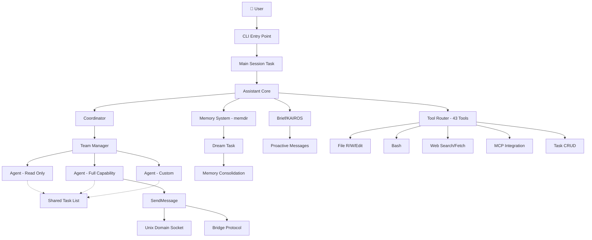
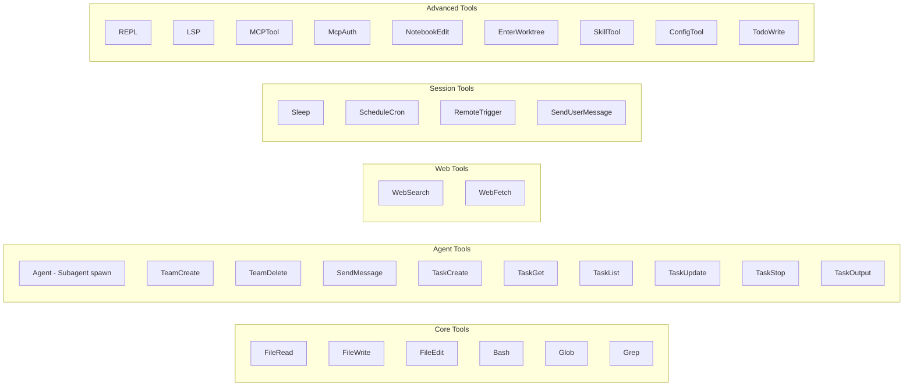
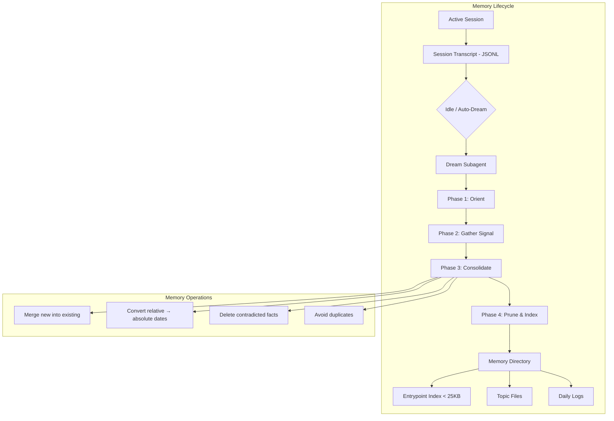
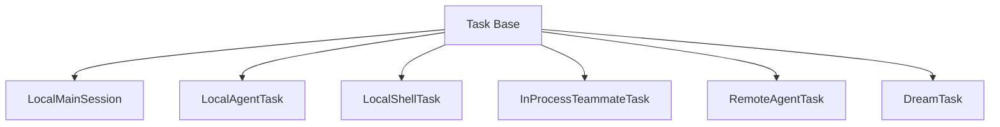

# Agent Orchestration Architecture

## High-Level System Architecture

```mermaid
graph TB
    User[👤 User] --> CLI[CLI Entry Point]
    CLI --> MainSession[Main Session Task]
    MainSession --> Assistant[Assistant Core]
    
    Assistant --> ToolRouter[Tool Router - 43 Tools]
    Assistant --> Coordinator[Coordinator]
    Assistant --> Memory[Memory System - memdir]
    
    Coordinator --> TeamCreate[Team Manager]
    TeamCreate --> Agent1[Agent - Read Only]
    TeamCreate --> Agent2[Agent - Full Capability]
    TeamCreate --> Agent3[Agent - Custom]
    
    Agent1 -.-> TaskList[Shared Task List]
    Agent2 -.-> TaskList
    Agent3 -.-> TaskList
    
    Agent2 --> SendMsg[SendMessage]
    SendMsg --> UDS[Unix Domain Socket]
    SendMsg --> Bridge[Bridge Protocol]
    
    Memory --> Dream[Dream Task]
    Dream --> Consolidation[Memory Consolidation]
    
    Assistant --> Brief[Brief/KAIROS]
    Brief --> Proactive[Proactive Messages]
    
    ToolRouter --> FileTools[File R/W/Edit]
    ToolRouter --> BashTool[Bash]
    ToolRouter --> WebTools[Web Search/Fetch]
    ToolRouter --> MCPTools[MCP Integration]
    ToolRouter --> TaskTools[Task CRUD]
```

## Tool System Architecture

```mermaid
graph LR
    subgraph "Core Tools"
        FileRead[FileRead]
        FileWrite[FileWrite]
        FileEdit[FileEdit]
        Bash[Bash]
        Glob[Glob]
        Grep[Grep]
    end
    
    subgraph "Agent Tools"
        Agent[Agent - Subagent spawn]
        TeamCreate[TeamCreate]
        TeamDelete[TeamDelete]
        SendMessage[SendMessage]
        TaskCreate[TaskCreate]
        TaskGet[TaskGet]
        TaskList[TaskList]
        TaskUpdate[TaskUpdate]
        TaskStop[TaskStop]
        TaskOutput[TaskOutput]
    end
    
    subgraph "Web Tools"
        WebSearch[WebSearch]
        WebFetch[WebFetch]
    end
    
    subgraph "Session Tools"
        Sleep[Sleep]
        ScheduleCron[ScheduleCron]
        RemoteTrigger[RemoteTrigger]
        Brief[SendUserMessage]
    end
    
    subgraph "Advanced Tools"
        REPL[REPL]
        LSP[LSP]
        MCP[MCPTool]
        McpAuth[McpAuth]
        Notebook[NotebookEdit]
        Worktree[EnterWorktree]
        Skill[SkillTool]
        Config[ConfigTool]
        TodoWrite[TodoWrite]
    end
```

## Memory System Architecture

```mermaid
graph TB
    subgraph "Memory Lifecycle"
        Session[Active Session] --> Transcript[Session Transcript - JSONL]
        Transcript --> DreamTrigger{Idle / Auto-Dream}
        DreamTrigger --> DreamAgent[Dream Subagent]
        
        DreamAgent --> Phase1[Phase 1: Orient]
        Phase1 --> Phase2[Phase 2: Gather Signal]
        Phase2 --> Phase3[Phase 3: Consolidate]
        Phase3 --> Phase4[Phase 4: Prune & Index]
        
        Phase4 --> MemDir[Memory Directory]
        MemDir --> Entrypoint[Entrypoint Index < 25KB]
        MemDir --> TopicFiles[Topic Files]
        MemDir --> DailyLogs[Daily Logs]
    end
    
    subgraph "Memory Operations"
        Merge[Merge new into existing]
        DateFix[Convert relative → absolute dates]
        Contradict[Delete contradicted facts]
        Dedup[Avoid duplicates]
    end
    
    Phase3 --> Merge
    Phase3 --> DateFix
    Phase3 --> Contradict
    Phase3 --> Dedup
```

## Task Types

```mermaid
graph TB
    Task[Task Base] --> LocalMain[LocalMainSession]
    Task --> LocalAgent[LocalAgentTask]  
    Task --> LocalShell[LocalShellTask]
    Task --> InProcess[InProcessTeammateTask]
    Task --> RemoteAgent[RemoteAgentTask]
    Task --> DreamTask[DreamTask]
```
